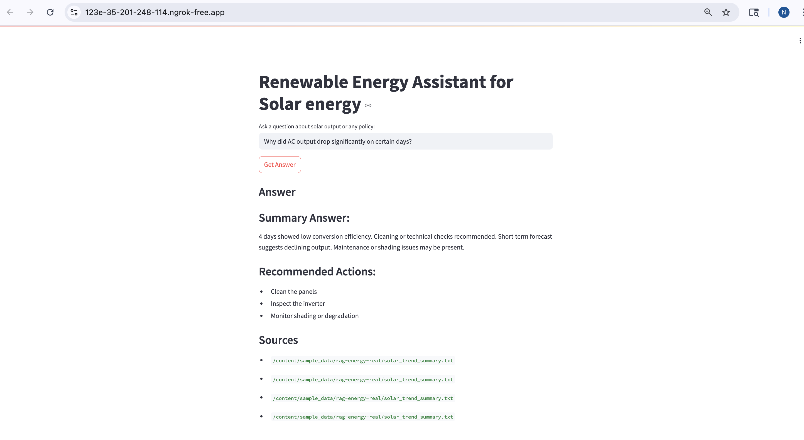

# Renewable Energy Assistant

A Retrieval-Augmented Generation (RAG) application that uses solar power data and government policy documents to answer natural language questions about renewable energy trends, AC output fluctuations, and policy guidance. Built using **LangChain**, **Qdrant**, and **Hugging Face LLMs**, Integrated with **Time-series** analysis and deployed via **Streamlit** and **ngrok**.

---

## Project Objective

This project helps users understand **solar power trends**, detect **AC output drops**, and interpret **state-level renewable energy policies** through a simple interface.

---

## Key Features

- Combines policy documents with the time-series analysis of solar output data available in the csv file.
- Provides the time-series trends in natural langugae format to the LLM
- Answers natural language queries about performance drops and forecasting.
- Highlights recommended actions (e.g., cleaning, shading issues).
- Easily extendable to other domains: energy, health, or education.


## Tech Stack

| Component | Library/Model |
|----------|----------------|
| Language Model | [`google/flan-t5-base`](https://huggingface.co/google/flan-t5-base) (Hugging Face Transformers) |
| Embedding Model | `sentence-transformers/all-MiniLM-L6-v2` |
| Vector Store | [Qdrant](https://qdrant.tech/) Cloud |
| Framework | LangChain |
| UI | Streamlit |
| Deployment | Google Colab + Ngrok |

---

## Input Data

- 'Plant_1_Generation_data.csv': Solar generation data taken from kaggle.(https://www.kaggle.com/datasets/anikannal/solar-power-generation-data?resource=download)
- `Gujarat_RE_Policy_2023.txt`: Government policy text with rules for net metering, incentives, etc. (https://cdn.vibrantgujarat.com/event/document/1698657395807-Gujarat-Renewable-Energy-Policy.pdf)
  
## Input Data for the LLM
- `solar_summary.txt`: Summarized solar AC/DC output over several days
- `solar_trend_summary.txt`: Time-series trend analysis of power output from the csv file (drop events, daily patterns)
- `Gujarat_RE_Policy_2023.txt`: Government policy text with rules for net metering, incentives, etc.

All data files are loaded, chunked, and embedded using Sentence Transformers before being indexed in **Qdrant**.

## RAG Pipeline

1. **Text Loading**: Load policy and time-series summary documents.
2. **Chunking**: Split into overlapping chunks for semantic search.
3. **Vector Embedding**: Embed with Hugging Face model.
4. **Store in Qdrant**: Cloud-based vector store.
5. **User Query** → Embedded → Qdrant retrieves top-k documents.
6. **LLM (Flan-T5)** generates a final natural language answer.

## Streamlit Interface

- Text input to ask questions like:
  - *"Why did AC output drop on certain days?"*
  - *"What does the policy say about net metering?"*
- Displays:
  - Structured answers (summary, drops, recommendations)
  - Sources from retrieved documents

> **Note**: UI is kept minimal to emphasize backend logic and retrieval accuracy.

---

##  Screenshot
> Add here if you choose to capture one from your Streamlit app:
```markdown



